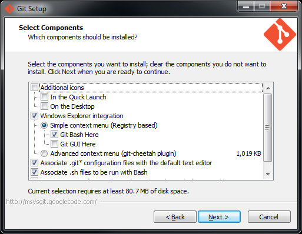
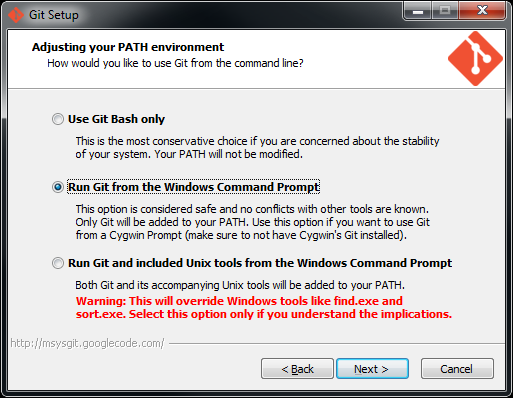
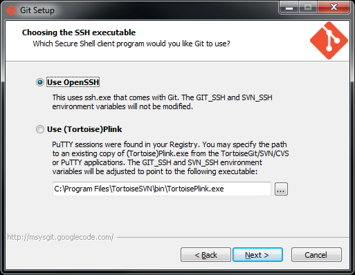
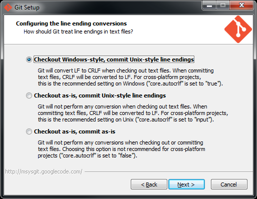

# Install Git

We recommend following these instructions for installing the base Git tool.

* Browse to [git-scm.com/downloads](http://git-scm/downloads).
* Download and run the installer.
* On the **Select Compenents** page of the installer: **unselect Git GUI Here** as shown below.

* Choose: **Run Git from the Windows Command Prompt**.

* Accept OpenSSH. (If you do not get this screen, that is OK. This page seems to have been removed in a recent version of the Git installer.)

* Accept Checkout Windows-style, commit Unix-style line endings.

* After the above screen the installation process should run and complete.
