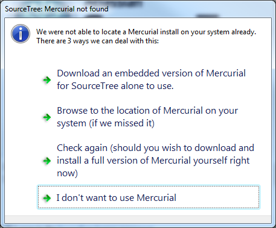
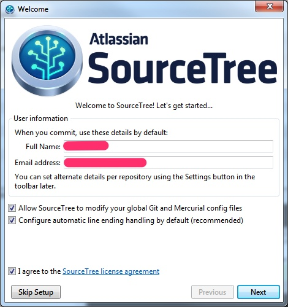
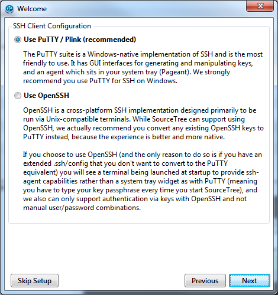
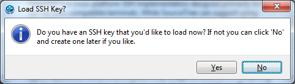
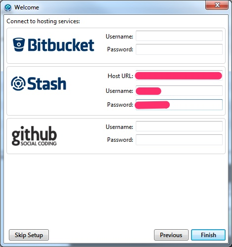
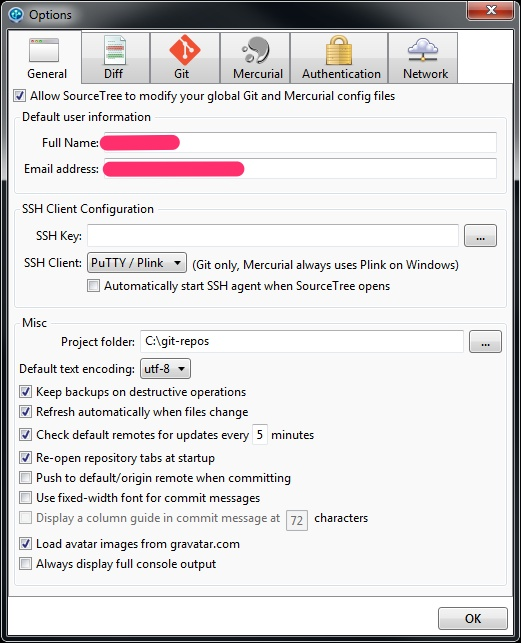
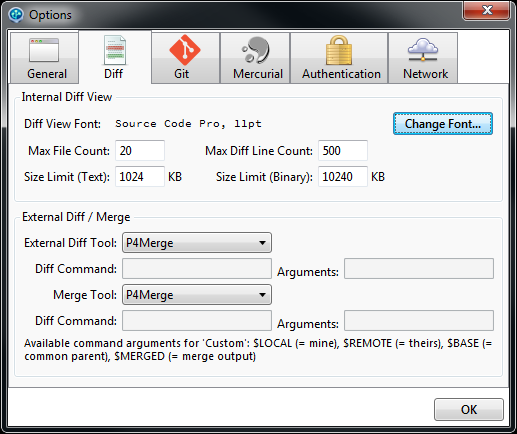
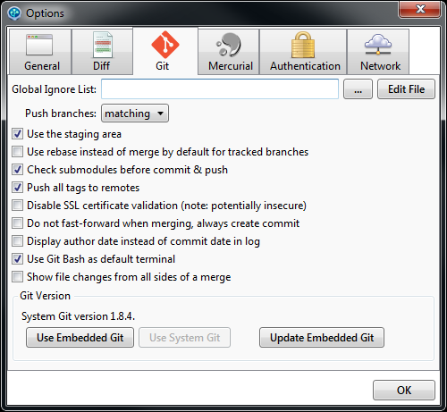

# Install Source Tree

1. Browse to [Source Tree Home Page](www.sourcetreeapp.com).
2. Download and run the installer.
3. Launch SourceTree. It will prompt you for some configuration information.
4. Select: I don't want to use Mercurial.

5. Fill in your user information.

6. We will not generally be using SSH to connect to our Git servers, so accepting the default on this screen if fine.

7. You do not need to configure an SSH key. Select No.

8. Fill in the host information for the Remote project hosts you have.

9. At this point the main SourceTree interface will open.
10. Open the options dialog by selecting the Tools → Options menu.
11. Uncheck the option to automatically start the SSH agent.

12. Fill in the Project folder with a convenient location, we recommend `C:\Code\git` (Note that this slightly different than the picture above). This path is the default location to put new Git repositories, you will have a chance to override it when creating or cloning individual repositories later.
13. Click to the "Diff" tab in the Options Menu.
14. Change your **External Diff Tool** and/or **Merge** to P4Merge or KDiff depending on personal preference.

15. Change to the **Git** Tab in Options.
16. Verify that the **Global Ignore List** is **empty**.

17. Click OK.
